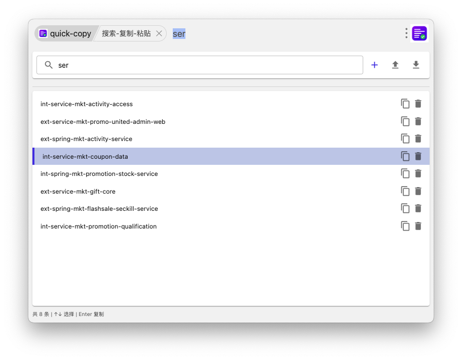
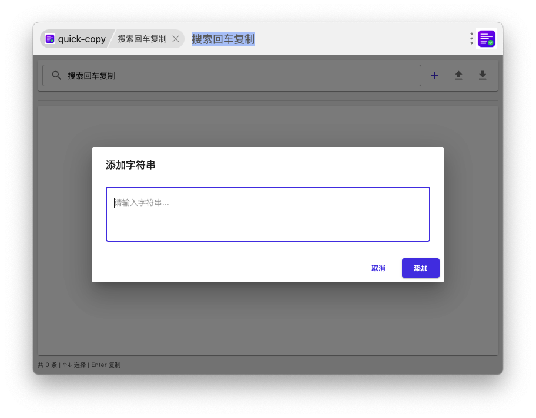
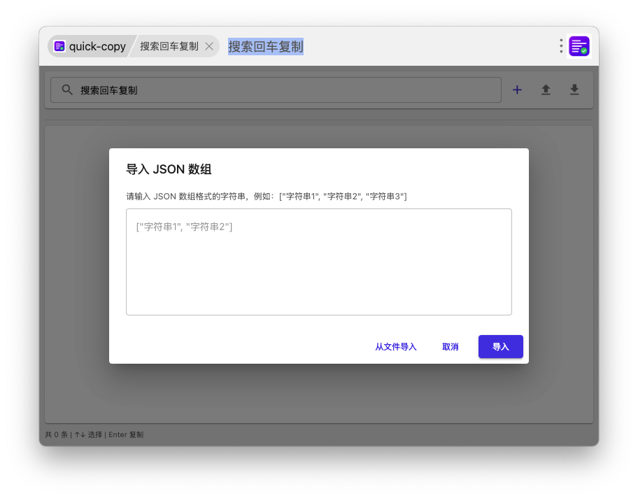

<h1 align="center">Quick Copy - uTools 快速复制插件</h1>

<div align="center">

基于 uTools 开发的快速搜索、复制、粘贴工具，支持键盘操作，提升日常效率。

[](https://u.tools/)
[](https://react.dev/)
[](https://mui.com/)
[](https://webpack.js.org/)

</div>

<div align="center">
  
  
  
</div>

## ✨ 功能特性

- 🔍 **快速搜索**：通过关键字快速查找已保存的字符串
- 📋 **一键复制**：回车键快速复制选中内容到剪贴板
- ⌨️ **键盘操作**：支持上下箭头选择，回车复制，无需鼠标操作
- 📥 **批量导入**：支持 JSON 格式的批量导入
- 📤 **导出备份**：导出所有数据为 JSON 文件，方便备份和迁移
- 🎨 **主题切换**：自动适配系统深色/浅色主题
- 💾 **数据同步**：基于 uTools 数据库，支持多设备同步
- 🚀 **自动粘贴**：复制后自动粘贴到光标位置（可选）

## 📸 使用演示

### 1. 快速搜索
在 uTools 搜索框输入关键字，插件会自动匹配并显示相关内容。

### 2. 键盘操作
- `↑` / `↓`：上下选择搜索结果
- `Enter`：复制选中内容并自动粘贴
- `Esc`：退出插件

### 3. 管理数据
- 点击 "+" 按钮添加新字符串
- 点击文件导入图标批量导入 JSON 数据
- 点击下载图标导出所有数据
- 点击删除图标移除不需要的字符串

## 🚀 安装方式

### 方式一：从应用市场安装
1. 打开 uTools
2. 搜索 "Quick Copy" 或 "快速复制"
3. 点击安装即可使用

### 方式二：手动安装
1. 下载最新版本插件包
2. 在 uTools 中进入"插件安装"
3. 选择插件包文件进行安装

## 🛠️ 开发指南

### 环境要求
- Node.js >= 18.11.0
- uTools [开发者工具](https://www.u-tools.cn/)
- uWorks 或 VSCode

### 安装依赖
```bash
npm install
```

### 开发模式
```bash
npm run dev
```
开发模式会监听文件变化，自动重新编译。

### 生产构建
```bash
npm run build
```
构建完成后，将 `dist/` 目录打包为插件进行安装。

### 项目结构
```
quick-copy/
├── dist/              # 构建输出目录
├── public/            # 静态资源
│   ├── plugin.json    # uTools 插件配置
│   ├── index.html     # 入口 HTML
│   └── logo.png       # 插件图标
├── src/               # 源代码
│   ├── App.js         # 主组件
│   ├── ErrorBoundary.js  # 错误边界
│   ├── index.js       # React 入口
│   └── index.less     # 全局样式
├── bridge/            # uTools 预加载脚本
│   └── preload.js     # Node.js/Electron API 桥接
├── package.json       # 项目配置
└── webpack.config.js  # Webpack 配置
```

### 技术栈
- **前端框架**：React 19.2.0
- **UI 组件库**：Material UI (MUI) v7
- **样式方案**：Less + Emotion
- **构建工具**：Webpack 5
- **Babel**：ES6+ 转 ES5
- **uTools API**：窗口、剪贴板、存储等

## 📖 使用说明

### 添加字符串
1. 打开插件
2. 点击工具栏的 "+" 按钮
3. 在弹出的对话框中输入字符串内容
4. 点击"添加"按钮保存

### 批量导入
1. 点击工具栏的导入图标
2. 选择"从文件导入"或直接粘贴 JSON 数据
3. JSON 格式示例：
```json
["字符串1", "字符串2", "字符串3"]
```

### 导出数据
点击工具栏的导出图标，所有数据将以 JSON 格式复制到剪贴板，可粘贴到文本文件保存。

### 搜索选择
1. 在搜索框输入关键字
2. 使用上下箭头键选择搜索结果
3. 按回车键复制并粘贴

## ⚙️ 配置选项

插件使用 uTools 数据库存储数据，存储键为 `string_list`，数据格式为 JSON 数组。

## 🔗 相关链接

- [uTools 开发者文档](https://www.u-tools.cn/docs/developer/basic/getting-started.html)
- [uTools API 参考](https://www.u-tools.cn/docs/developer/utools-api/window.html)
- [React 官方文档](https://react.docschina.org/)
- [Material UI 文档](https://mui.com/material-ui/)

## 🤝 贡献指南

欢迎提交 Issue 和 Pull Request！

1. Fork 本项目
2. 创建特性分支 (`git checkout -b feature/AmazingFeature`)
3. 提交更改 (`git commit -m 'Add some AmazingFeature'`)
4. 推送到分支 (`git push origin feature/AmazingFeature`)
5. 开启 Pull Request

## 📝 更新日志

### v1.0.0 (2026-03-12)
- ✨ 首次发布
- 🔍 支持快速搜索
- ⌨️ 支持键盘导航
- 📥 支持批量导入/导出
- 🎨 支持深色/浅色主题
- 🚀 支持自动粘贴功能

## 📄 许可证

本项目采用 MIT 许可证 - 详见 [LICENSE](LICENSE) 文件

## 🙏 致谢

- [uTools](https://www.u-tools.cn/) - 强大的效率工具平台
- [React](https://reactjs.org/) - 用于构建用户界面的 JavaScript 库
- [Material UI](https://mui.com/) - React 组件库

## 📧 联系方式

如有问题或建议，欢迎提交 Issue 或通过以下方式联系：

- Email: itguang@qq.com
- GitHub Issues: [提交问题](../../issues)

---

---

<div align="center">

Made with ❤️ by [小光光](https://github.com/itguang)

</div>
